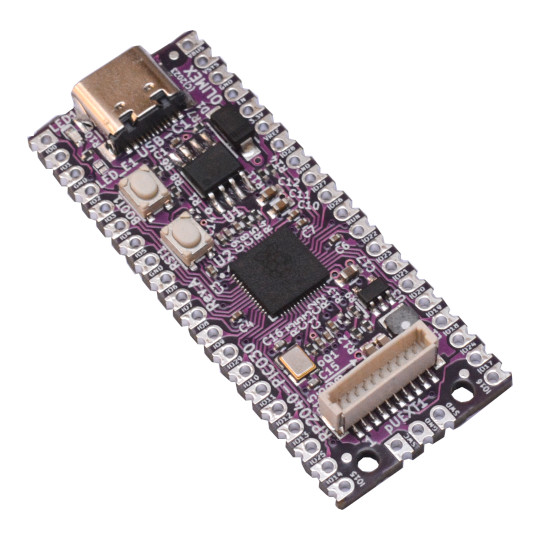

# RP2040-PICO30

RP2040-PICO30 is Open Source Harrdware re-design of original RP2040-PICO from Rqaspberry Pi 

## Features

* RP2040 CortexM0 microcontroller
* RP2040-PICO pinout and dimentions
* SY8089A 3.3V 2A (3A peak) DCDC power supply
* 30 GPIOs available to the user
* USB-C High Speed USB 2.0 connector for powering the board and communication
* Boot button
* RESET button
* 2MB or 16MB Flash
* Optional UEXT connector (U version)
* Optional status LED (U version)
* Dimensions 51 x 21 mm

Product page: https://www.olimex.com/Products/MicroPython/RP2040-PICO30/open-source-hardware

## Licenses

* Hardware is released under CERN Open Hardware Licence Version 2 - Strongly Reciprocal, all silkscreen credits to Olimex should remain;
* Software is released under GPL3 Licensee
* Documentation is released under CC BY-SA 3.0
